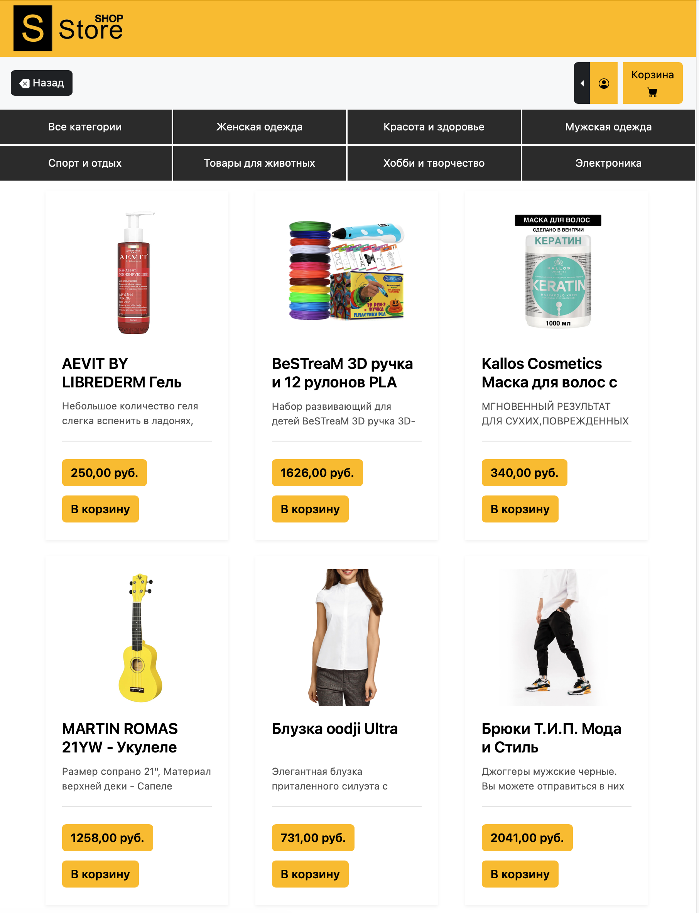
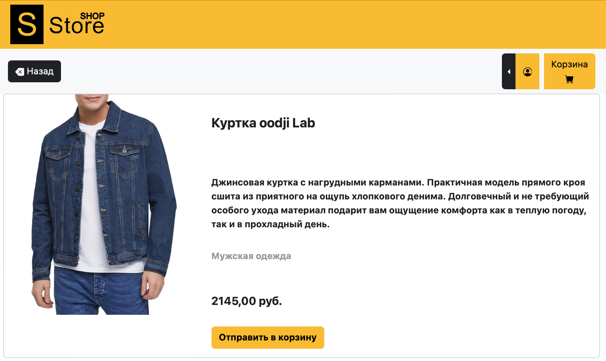
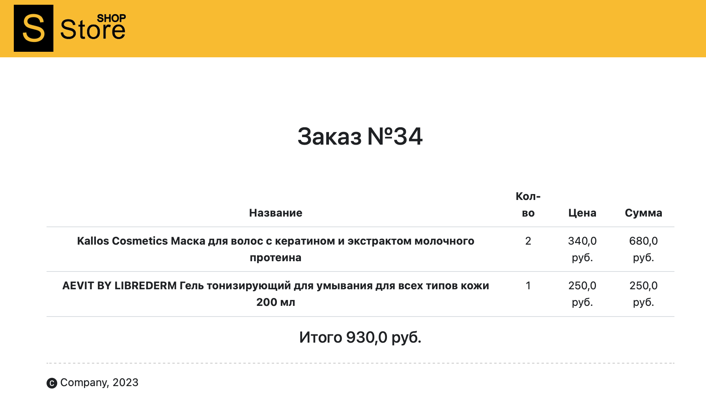

# Интернет-магазин

## Онлайн-магазин "Store-shop"

Интернет-магазин, в котором можно быстро и, не выходя из дома,
приобрести различные товары, сортируя по различным категориям. 

### Запуск проекта: 
* Для запуска необходимо перейти в терминал с текущим кодом
и ввести команду `python manage.py runserver`.
* Сайт будет доступен по адресу: http://127.0.0.1:8000/

### Структура сайта: 

* Главная страница.
* Каталог с фильтром и сортировкой: сам каталог товаров, детальная страница товара.
* Оформление заказа: корзина, оформление заказа, оплата.
* Личный кабинет: профиль, история заказов.
* Административный раздел: просмотр и редактирование товаров, просмотр и редактирование заказов, просмотр и редактирование категорий каталога.

### Особенности реализации кода проекта: 

* Использование модуля из стандартной библиотеки Python, который позволяет настраивать логирование из скрипта.
* Разработка проекта на фреймворке Django.
* Запуск проекта осуществляется путем клонирования репозитория и выполнением миграции. 

### Url-адреса:
* / - главная страница
* **/product_list/** — каталог товаров;
* **/category/int:category_id/** — каталог товаров определенной категории;
* **/int:product_id/**  — детальная страница товара;
* **/users/profile/** — личный кабинет пользователя с корзиной;
* **/orders/** — список заказов;
* **/orders/order-create/** — оформление заказа;
* **/order/order_id/** — детали заказа.

После перехода на страницу о детелях товара 
выводятся данные по определенному товару.

В эти данные входят:
* Название товара
* Детальная информация о товаре
* Категория товара
* Цена 
* Изображение товара

После перехода в личный  
кабинет пользователя выводятся данные о текущем пользователе.

В эти данные входят:
* Имя и фамилия
* Аватарка
* Имя пользователя
* Адрес электронной почты 
* Данные о корзине текущего пользователя  

### Примеры использования:

**Главная страница:**

**Страница каталога:**

**Детали товара:**

**Детали заказа:**

